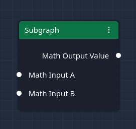

# Subgraphs

Subgraphs can help you to build more complex models or avoid repeating the same nodes over and over again.

Subgraphs can be viewed as re-usable templates. A subgraph consists of a set of connected nodes separate from the
_main_ graph. There can be many subgraphs. There can also be subgraphs within another subgraph.

## Create new Subgraph

You can create a new subgraph by adding and selecting at least one node in the current view of the model
editor. Then, clicking on the `Create Subgraph` button in the top menu of the model editor will create a new subgraph.

The model editor will automatically switch the current view to the new subgraph and move all previously selected nodes
to this new subgraph.

Note that there are now new nodes available in the _Node Palette_:

- Subgraph Input Node
- Subgraph Output Node

Also, some nodes disappeared from the _Node Palette_. There cannot be used inside a subgraph:

- Debug Node
- Histogram Node
- Estimate Node
- Result Node

> Warning: You can trick the model editor into adding these nodes to a subgraph. However, they will not work or cause
> unexpected behavior.

Also note that there are now additional buttons available in the top menu of the model editor:

- Save Subgraph button (floppy disk icon)
- Back to Main Graph button (left arrow icon)

## Subgraph Input and Subgraph Output Nodes

Subgraph input nodes provide variables to the subgraph that can be used for calculations. Subgraph output nodes expose
the results of these calculations to the graph that uses a subgraph.

A subgraph requires at least one subgraph input node and one subgraph output node. Without them, a subgraph could not
calculate anything.

Each input and output node can be given two labels. The node label (top label) is not used in any way. The connection
label (inside the node) determines the label of the corresponding input property when using a subgraph.

For example, let's consider the following subgraph:

The labels `Math Input A` and `Math Input B` and `Math Output Value` can be changed to any name. They will determine the
connection labels of the subgraph node when referencing this subgraph in another graph:

Unfortunately, due to technical limitations, subgraph input nodes require that their input data type is specified
inside a subgraph. The input type (meaning _deterministic_, _probabilistic_ or _series_) is required to perform all
calculations inside a subgraph.

The input type can be specified by adding and connecting a Type Constraint node to a subgraph input node. They are
required for all subgraph inputs that otherwise would be connected to a white connection point of an operation
node. In other words, subgraphs are not allowed to have white input connection points (i.e., undetermined input types).

The example above needs to be complete as follows:

Accordingly, the corresponding subgraph node will not contain any white connection points:

## Saving a Subgraph

While editing a subgraph, any changes to the subgraph will only take effect as soon as you saved the subgraph or closed
it and returned to the main graph. You can save a subgraph by clicking on the _Save Subgraph_ button
(floppy disk icon) in the top menu of the model editor.

## Using a Subgraph

You can use a subgraph by adding the corresponding subgraph node from the _Node Palette_ and connecting each input and
at least one output to it.

You may also add a subgraph to another subgraph. However, there can be no circular references. In other words, a
subgraph is not allowed to be included in a subgraph that already includes the former.

The model editor will check this and not show subgraph nodes that cannot be added to a subgraph because it would create
a circular reference.

## Why can I not use a Display Node?

Subgraphs are templates. They can be added multiple times to the _main_ graph or other subgraphs. Because of that, it
is not known in advance what data flows through a subgraph. Therefore, display nodes cannot show any information.

If you would still like to check what is happening inside a subgraph, you have to add a subgraph output node and
connect a display node (from the main graph) to the output connection of the subgraph node.
