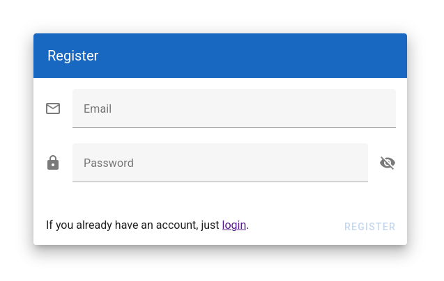

# Getting Started

Welcome to the Decision Support UI! In this section, we will go through every step of this application, starting with:

1. Create an Account and Login
2. Load an Example Model
3. Run a Monte Carlo Simulation
4. Create Your Own Model
5. Save and Load a Model

## Create an Account and Login

To use the full potential of the Decision Support UI, you should create an account. Your account allows you to
save, load and evaluate models. Otherwise, you cannot generate the result diagram for your model.

You can create an account by clicking on the "Create a free account!" link on the login page:

You need to provide both an email address and password. However, the email address does not need to exist.
You can use any email address to create an account. The Decision Support UI will not send a confirmation email.

In case you use the desktop version, all data is stored on your computer. In case you use the Decision Support UI with
a browser, the email address, password and your models are stored on the respective server owned by the company or
institution that provides the server.

Once you registered an account, you may log in with the same email address and password.

## Load an Example Model

After you logged in, you will be greeted with a list of existing models. Of course, in the beginning, you will not
have created any models yet. However, you can load an example model by selecting the "Examples" tab:

Start with the first example model by clicking on the entry "1. Minimal Model". Loading a model will open the model
editor. Here you can inspect the model, modify it, save it, evaluate it, add notes, and so on:

The model editor is quite complex. There is a separate help page "Model Editor" in the help section "User Interface"
that describes every detail.

## Run a Monte Carlo Simulation

The minimal example model consists of a single input variable called "Estimate Node" and a single output variable
called "Result Node". This simple example does not make sense yet in the context of comparing multiple outcomes of a
decision, but can be used to test that you can evaluate a model by running a Monte Carlo simulation.

Click on the blue rocket button in the bottom-right corner to start the Monte Carlo simulation. After a few seconds,
the progress circle should disappear. You can now inspect the results in the "Result dashboard" (the third icon from
the top in the main menu on the left).

The result diagram visualizes all probabilistic output variables in a combined histogram.

## Create Your Own Model

To create your own model, switch back to the model list by clicking on the second item from the bottom of the
main menu on the left. On the model list page, click on the "New Model" button to create a new empty model.

You need to add at least on "Estimate" and one "Result" node. You can find detailed information about each note type in
the "Model Editor" documentation in the help section "User Interface". Also, take a look at the examples to get a
better understanding of how nodes can be used in common scenarios.

## Save and Load a Model

If you are happy with your model, you can save it by clicking on the "floppy disk" button in the bottom-right menu of
the model editor. Specify a unique name for your model and confirm the dialog to save your model.

Once you have saved a model, you can access it again later from the model list page.
It should be listed in the "Your Models" tab.
