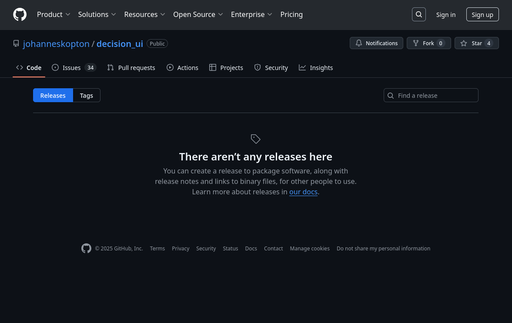
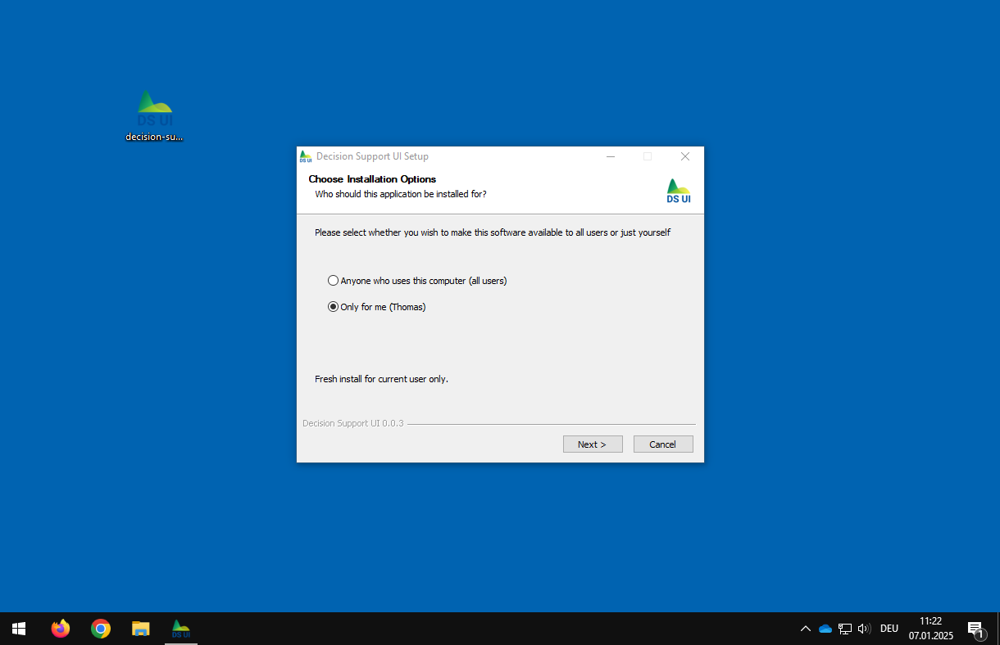
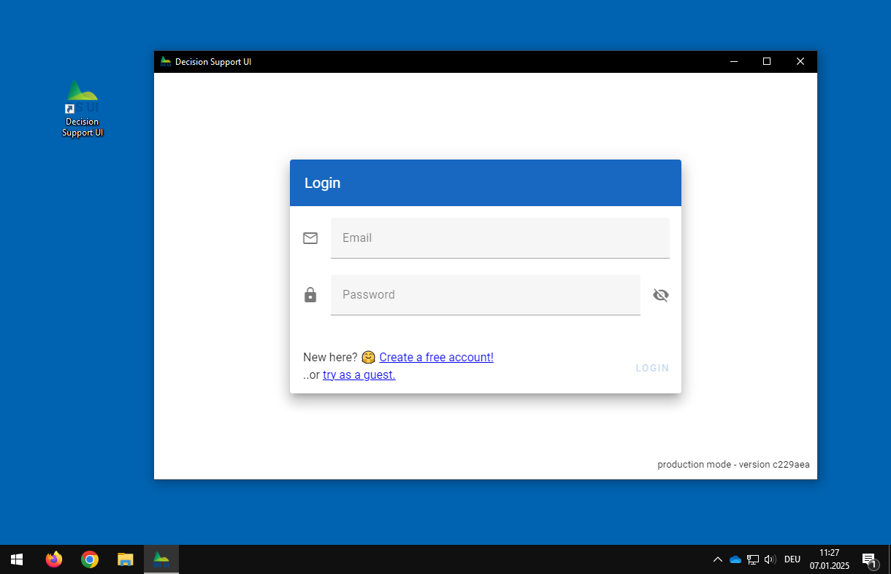
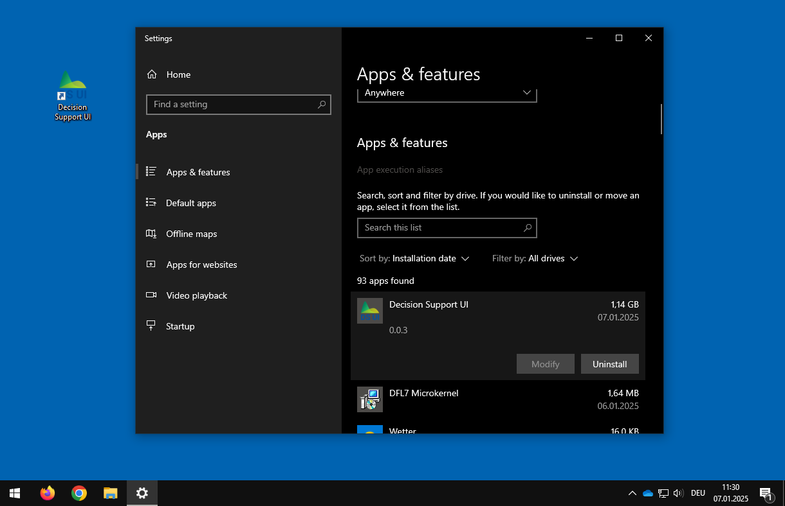
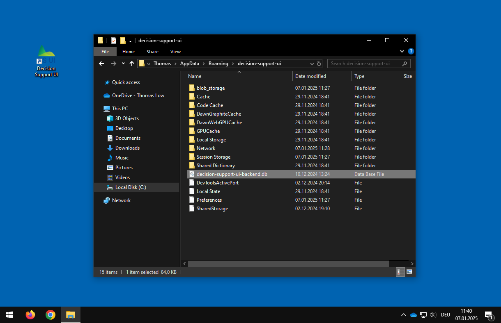

# Installation

This application can be installed in multiple ways:

- Desktop Installation on Windows
- Container Installation on Linux
- Container Installation on MacOS
- Installation From Source

## Desktop Installation on Windows

In order to install the Decision Support UI as a desktop application, please download and run the latest Windows
installation wizard executable from the [releases page](https://github.com/johanneskopton/decision_ui/releases) on
GitHub (e.g. the file `decision-support-ui-X.X.X-setup.exe`).



There a no additional requirements. The installation wizard will guide you through the installation process.



Afterwards, you can start the application by clicking on the corresponding desktop icon or start menu entry.



### Uninstall

You can remove the applicatiom from the Windows settings page called `Apps & features` or `Add and Remove Programs`:



### Backup

You may create a backup of your data (user accounts and models) by copying the file `decision-support-ui-backend.db`
from the directory `%APPDATA%\decision-support-ui`.



Please keep in mind that this file is most likely not compatible with a different version of the application.

## Container Installation on Linux

On Linux, you can install the application using [Docker](https://www.docker.com/), [Podman](https://podman.io/) or
similar container management tools. Please follow their respective installation instructions or install the tools
from the software repository of your favorite Linux distribution.

The following instructions are based on Fedora Linux and Podman.

### Build Container Image

As of now, there are no pre-built images available on [Docker Hub](https://hub.docker.com/). Instead, you have to build
an image yourself.

First, download the source code from GitHub:

```
git clone https://github.com/johanneskopton/decision_ui.git
```

You can find the necessary files in the directory `deployment/staging`. For performance reasons, the Dockerfile is
split into two files:

- `Dockerfile.base`: installs basic build and software dependencies
- `Dockerfile.server`: installs and runs the application

Both images need to be built before the application can be started.

```
podman build -f deployment/staging/src/Dockerfile.base -t localhost/decision-support-ui/base:latest .
podman build -f deployment/staging/src/Dockerfile.server -t localhost/decision-support-ui/server:latest .
```

Building the base image will download, compile and install R and the [decisionSupport](https://cran.r-project.org/web/packages/decisionSupport/index.html) package from CRAN. This process might take a long time (up to 30 minutes). Building the
server image should only take a few seconds.

### Run Image

Once the build process has finished successfully, the server container can be started:

```
podman run \
    --rm -it \
    -v /path/to/some/directory:/root/workspace/code/backend/data:Z \
    -p 8080:8080 \
    -e DSUI_SECRET=default_secret \
    localhost/decision-support-ui/server:latest
```

The following arguments can to be provided:

- `--rm` \
  delete the container after stopping it
- `-it` \
  run container as interactive terminal
- `-v /path/to/some/directory:/root/workspace/code/backend/data` \
  mount the data directory such that models are stored permanently on the host machine
  (append `:Z` on Linux distributions with [SELinux](https://en.wikipedia.org/wiki/Security-Enhanced_Linux))
- `-e DSUI_SECRET=default_secret` \
  specify a custom secret (random characters, similiar to a password) to ensure that the application can securely
  encrypt login data
- `-e JWT_TOKEN_LIFETIME=600` \
  lifetime of the JSON Web Tokens (JWT) in seconds (default is 10 minutes)
- `-e DSUI_LOG_LEVEL=DEBUG` \
  show debug messages (default level is `INFO`)
- `-e DSUI_R_MAX_RUNTIME=10` \
  maximum runtime of R script in seconds (default 10 seconds)
- `-e DSUI_R_MAX_MCRUNS=100000` \
  maximum number of monte carlo runs that are allowed to run in the backend (default 100.000)
- `-e DSUI_R_MAX_BINS=200` \
  maximum number of histogram bins that can be generated in the backend (default 200)

As soon as the application is started, you can access the user interface from your browser using the address
[`http://localhost:8080`](http://localhost:8080).

You can stop the application by typing `CTRL + C` in the terminal.

## Container Installation on MacOS

As of now, an installation on MacOS was not tested yet. However, it should be possible to use
[Podman](https://podman.io/) on MacOS by following the
[instructions](https://www.redhat.com/en/blog/run-containers-mac-podman) to setup the Podman command line
interface on MacOS and adapting the `Container Installation on Linux` instructions above.

## Installation from Source

In all other scenarios, you may also install the decision support user interface from its source code. The are three
main requirements:

- [Python 3](https://www.python.org) (tested with v3.13.0)
- [NodeJS](https://nodejs.org/) (tested with v22.11.0)
- [R](https://www.r-project.org/) (tested with v4.4.2)

### Install R and the decisionSupport package

On Windows, you can use the batch script `code/backend/bin/install-r.bat`. It will download and install R in the
directory `code/backend/resources/R`.

For other operating systems, please follow the respective installation instructions for that plattform.

In addition, you need to install the
[`decisionSupport`](https://cran.r-project.org/web/packages/decisionSupport/index.html) and `readr` package from CRAN.
You can install them with the following R command:

```
install.packages(c("decisionSupport", "readr"))
```

The application needs to know the correct location of the R executable file. In case the `Rscript` command is available
on your terminal, Python should detect it and use it by default. Otherwise, you need to specify the envionment variable
`DSUI_R_SCRIPT_PATH` with your custom path to the `Rscript` executable file. Make sure that the respective R
environment contains the required packages. Run the following R commands and verify that there are not error messages:

```
library(readr);
library(decisionSupport);
```

### Install Python

For Python, please follow the official [installation instructions](https://docs.python.org/3/using/index.html).
Make sure that the `python` command is available in your terminal.

### Install NodeJS

For NodeJS, please follow the official [installation instructions](https://nodejs.org/en/download). Make sure that the
`node` and `npm` command is available in your terminal. Also install the Javascript tool
[`concurrently`](https://www.npmjs.com/package/concurrently) by executing:

```
npm install -g concurrently
```

### Download Source Code and Install Dependencies

Download the source code from GitHub:

```
git clone https://github.com/johanneskopton/decision_ui.git
```

Install further software libraries (python packages and Javascript libraries) by executing the bash script
`bin/install.sh` (or Windows batch file `bin/install.bat`).

### Build the application

You can build the application by executing the bash script `bin/build.sh` (or Windows batch file
`bin/build.bat`).

### Run the application

You can start the application by executing the bash script `bin/run-webapp.sh` (or Windows batch file
`bin/run-webapp.bat`).
