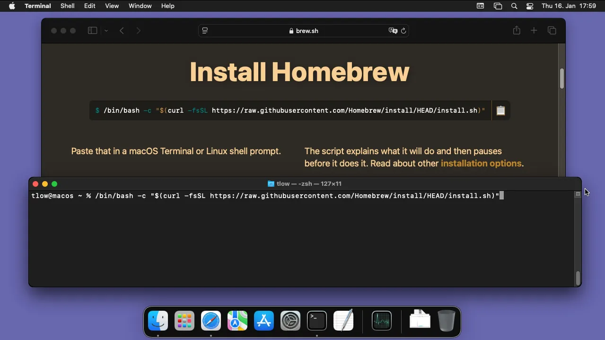
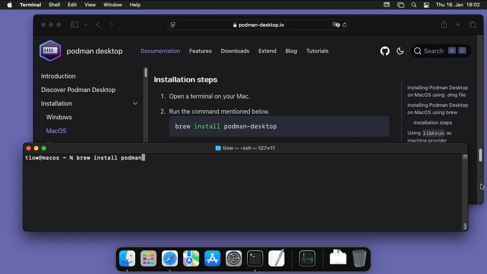
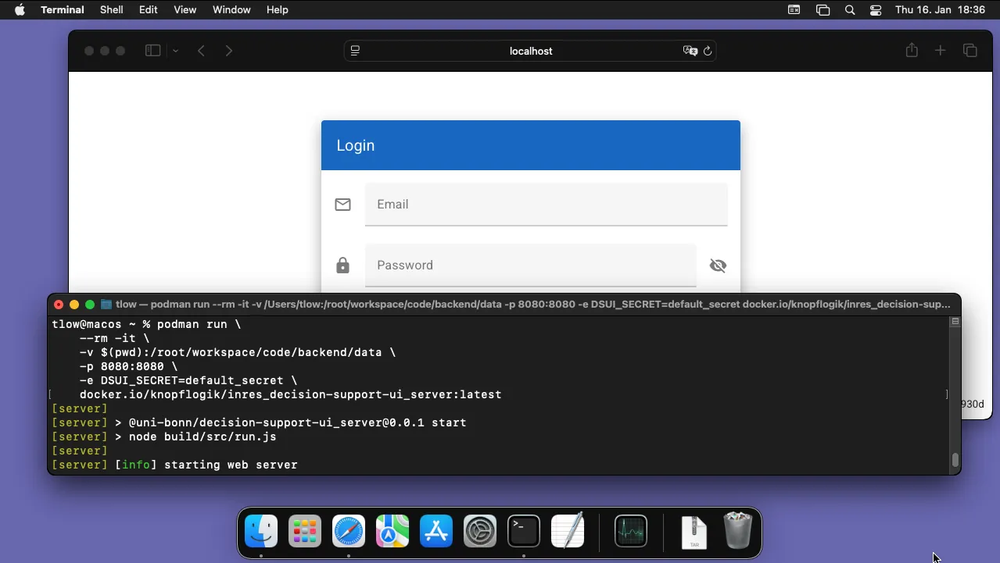

# MacOS Installation

## Container Installation on MacOS

To run the Decision Support UI on MacOS, a container management tool is required, for example
[Docker](https://www.docker.com/) or [Podman](https://podman.io/).

You can install Podman either as a [desktop tool](https://podman-desktop.io/) or command line tool.

The command line version of Podman can be installed via [Homebrew](https://brew.sh/), a package manager for MacOS.
Follow the installation instructions on the Homebrew webpage.



Make sure to read the script output when installing
Homebrew. It recommends additional commands that make the `brew` command available in your terminal.

Once Homebrew is installed, you can install Podman with the following command:

```
brew install podman
```



Podman requires a virtual machine on your MacOS. You can set up this virtual machine with the following command:

```
podman machine init --now
```

You may specify a specific number of CPU cores or disk size that is made available to the virtual machine, see the
description of the [machine init](https://docs.podman.io/en/latest/markdown/podman-machine-init.1.html) command.

Now, you can start the decision support user interface with the following command:

```
podman run \
    --rm -it \
    -v $(pwd):/root/workspace/code/backend/data \
    -p 8080:8080 \
    -e DSUI_SECRET=default_secret \
    docker.io/knopflogik/inres_decision-support-ui_server:latest
```



Instead of `$(pwd)`, your current directory of your terminal, you can also specify any other directory that will be
used to permanently store the database on your host machine. A comprehensive list of all arguments is given in the
Linux installation instructions.

Finally, open [http://localhost:8080](http://localhost:8080) in your browser.

## Build the Container Image

To build the container image yourself, you need to download the source code from GitHub:

```
git clone https://github.com/johanneskopton/decision_ui.git
cd decision_ui
git checkout knopflogik-improvements
```

Afterward, you can build the container image by running the following two commands:

```
podman build -f deployment/staging/src/Dockerfile.base -t localhost/decision-support-ui/base:latest .
podman build -f deployment/staging/src/Dockerfile.server -t localhost/decision-support-ui/server:latest .
```

Then, you can start the Decision Support UI using the same `podman run` command (see above), except that you need to
replace the last parameter with `localhost/decision-support-ui/server:latest`.
