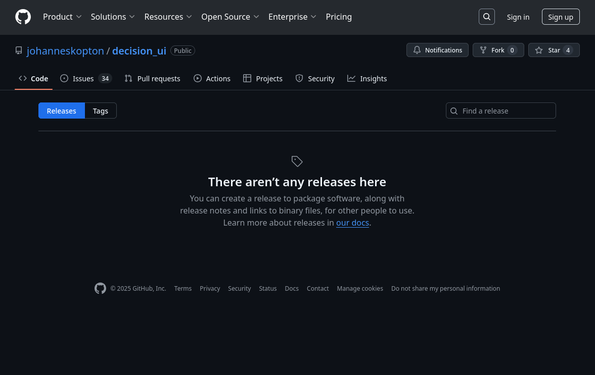
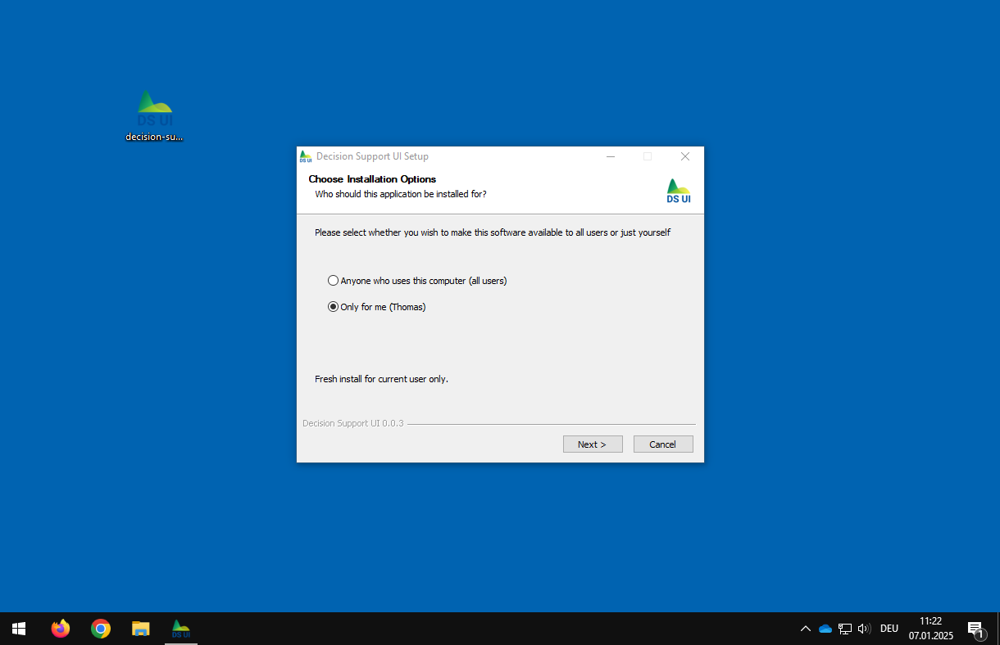
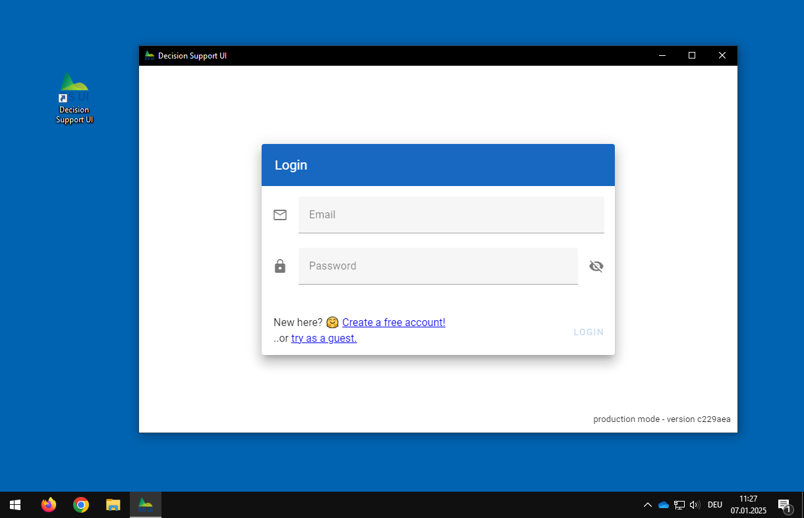
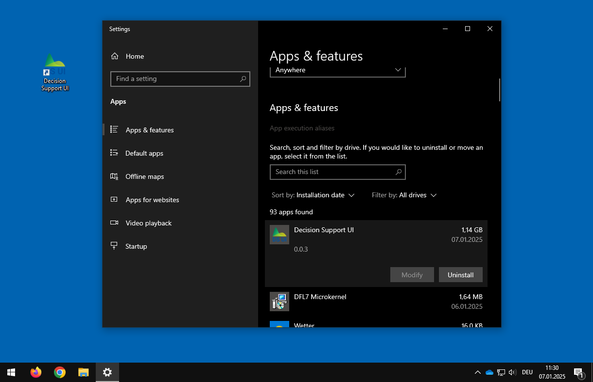
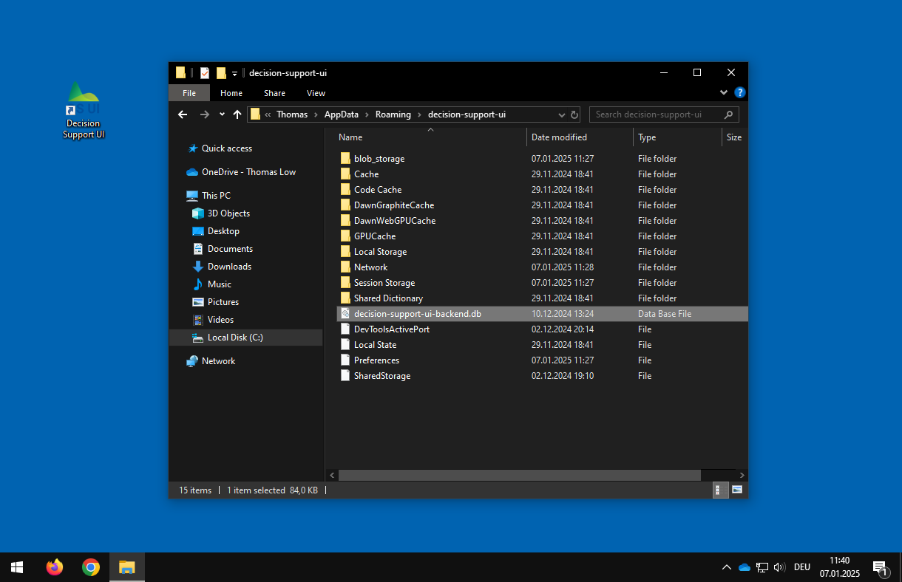

# Windows Installation

You may install the software either:

- as a desktop application using the pre-built installation wizard, or
- manually from source code

## Desktop Setup

In order to install the Decision Support UI as a desktop application, please download and run the latest Windows
installation wizard executable from the [releases page](https://github.com/johanneskopton/decision_ui/releases) on
GitHub (e.g., the file `decision-support-ui-X.X.X-setup.exe`).



There a no additional requirements. The installation wizard will guide you through the installation process.



Afterward, you can start the application by clicking on the corresponding desktop icon or start menu entry.



### Uninstall

You can remove the application from the Windows settings page called `Apps & features` or `Add and Remove Programs`:



### Backup

You may create a backup of your data (user accounts and models) by copying the file `decision-support-ui-backend.db`
from the directory `%APPDATA%\decision-support-ui`.



> NOTE: Please keep in mind that this file is most likely not compatible with a different version of the application.

## Installation from Source

You may also install the decision support user interface from its source code. There are three main requirements:

- [Python 3](https://www.python.org) (tested with v3.13.0)
- [Node.js](https://nodejs.org/) (tested with v22.11.0)
- [R](https://www.r-project.org/) (tested with v4.4.2)

### Install R and the decisionSupport package

You can use the batch script `code/backend/bin/install-r.bat`. It will download and install R and the decisionSupport
CRAN package in the directory `code/backend/resources/R`.

### Install Python

For Python, please follow the official [installation instructions](https://docs.python.org/3/using/index.html). During
the setup, make sure to select the option that the `python` command is added to the `PATH` environment and available in
your terminal.

### Install Node.js

For Node.js, please follow the official [installation instructions](https://nodejs.org/en/download). During the setup,
make sure to select the option that the `node` and `npm` command is added to the `PATH` environment and available in
your terminal.

Afterward, install the Javascript tool [`concurrently`](https://www.npmjs.com/package/concurrently) by executing the
following command in a terminal:

```
npm install -g concurrently
```

### Download Source Code and Install Dependencies

You may either download the source code as a Zip file and extract all files into a directory of your choice.

Otherwise, follow the official [installation instructions](https://git-scm.com/downloads/win) for
[Git](https://git-scm.com/) on Windows.

Download the source code from GitHub via Git by executing the following command in a terminal:

```
git clone https://github.com/johanneskopton/decision_ui.git
cd decision_ui
git checkout knopflogik-improvements
```

Install further software libraries (python packages and Javascript libraries) by executing the Windows batch file
`bin/install.bat`.

### Build the application

You can build the application by running the Windows batch file `bin/build.bat`.

### Run the application

You can start the application by executing the Windows batch file `bin/run-webapp.bat`.
