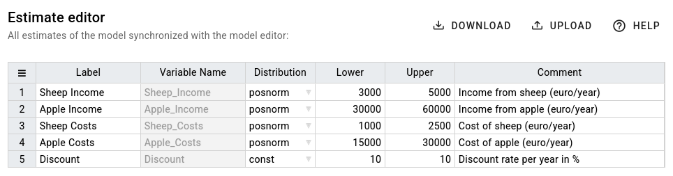

# Estimate Editor

The estimate editor provides an overview over all estimate nodes of your model. For each estimate node, there is a
corresponding row in the estimate table. Parameters like the name of the estimate and its distribution type are
synchronized with the nodes in the model editor.

You may change the parameter of an estimate by double-clicking on the corresponding cell in the estimate table. Any
changes will be immediately reflected in the model editor. However, you need to re-evaluate the model by clicking on
the rocket button to generate an updated result diagram.

The table contains the following columns:

- `Label` \
  the estimate node label that is shown at the top of a node
- `Variable Name` \
  The name of the variable that is used inside the R-code for that particular estimate. It is inferred from the label
  of an estimate.
- `Distribution` \
  The distribution type of the estimate. It can be either `const` (deterministic estimate), `norm` (normal distribution),
  `posnorm` (one-sided truncated normal distribution with positive values only), `t_norm_0_1` (two-sided truncated normal distribution between with values between 0 and 1)
- `Lower` \
  Lower bound of the 90% confidence interval, i.e., the 5%-[quantile](https://en.wikipedia.org/wiki/Quantile)
  of the distribution
- `Upper` \
  Upper bound of the 90% confidence interval, i.e., the 95%-[quantile](https://en.wikipedia.org/wiki/Quantile)
  of the distribution
- `Comment` \
  A comment that describes the estimate in more detail.

## Download and Upload Estimates as CSV

In case you would like to save and compare multiple variations of estimate parameter settings, you can download the
estimate table as a CSV file by clicking on the download button.

The CSV file contains an additional column `node` that is used to match a CSV row to the node of
your model. Please do not modify this unique identifier for a node. Otherwise, you will not be able to correctly load
the CSV file.

Except for the `node` and `Variable Name` column, you may change any other columns in the CSV file.

To apply your changes, you can load the modified CSV file by clicking on the upload button.
