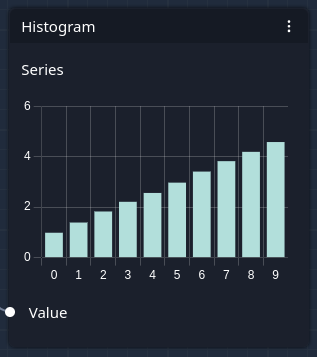
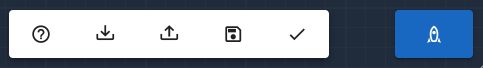

# Model Editor

The model editor allows building a mathematical representation of a decision and its outcomes. It uses interconnected
boxes called _nodes_ to design a mathematical function as a computational network called a _graph_. Because of that,
users do not need to be familiar with writing R-code. However, eventually, the model graph is converted to R-code,
which is then used to run a Monte Carlo simulation to evaluate all outcomes of a decision-making process.

The model editor is divided into multiple parts:

- Node Palette - shows all available node types
- Work Space - contains the nodes that define the decision model
- Top Menu - various functions to work with nodes
- Bottom Menu - allows loading, saving, validating and running the model

The following screenshot highlights each part of the model editor:

## Node Palette

The node palette contains a list of all available nodes that can be used to build a model.

You can insert a node into the work space by clicking, holding and dragging a box from the node palette to the work
space area.

Alternatively, you can right-click on the work space area and select a node type from the menu.

## Nodes

A node consists of various parts:

- Name of the Node - references a node and is converted to a matching variable name in the R-code
- 3-dot Menu - allows renaming or deleting a node
- Node Inputs - properties that influence the calculations inside a node
- Node Outputs - the results of these calculations
- Connection Points - contact points that can be used to connect the output of one node to the input of another node

Connection points have different shapes and colors to indicate the data type of the corresponding input or output value:

- yellow - constant value
- cyan - random sample
- purple - series (list of random samples)
- white - flexible value, may be either constant value, random sample or series
- round - floating-point number(s)
- rectangular - integer number(s)

You may connect nodes by clicking, holding and dragging a connection point from one node to a connection point of
another node. If a connection can be made (compatible input and output types), the connecting line turns green. If a
connection cannot be made (incompatible input and output types), the connecting line turns red. You can only connect
outputs of one node with inputs of another node.

### Display Nodes

The following nodes are used to display various information inside the graph. None of the display nodes influence the
mathematical evaluation of the model.

#### Debug Node

The debug node can be used to show the actual data that is flowing through the connected node. It is mostly used by
developers to verify that the model evaluation is working correctly.

Debug nodes cannot be added to subgraphs.

#### Histogram Node

The histogram node visualizes the data that is flowing through the connected node as a histogram. If it is connected
to a random sample output, it will show the distribution of the random sample:

The number of histogram bins is determined by the setting "Histogram Bins" on the settings page.

If it is connected to a series output (a list of random samples), it will show the average of each random sample in a
bar chart:

> NOTE: In the future, this should be improved to show a box plot or violin plot.

Histogram nodes cannot be added to subgraphs.

#### Note Node

The note node can be used to add any text to a model, e.g., to describe a particular section of the model.

### Input & Output Nodes

The following nodes represent the input and output variables of a model.

#### Estimate Node

An estimate node allows adding an input variable or _estimate_ to your model. It may either be a deterministic
estimate, meaning a constant input, or a probabilistic estimate, meaning an input that follows a random process. In the
latter case, you need to choose one of the supported probability distributions that best describes your input variable:

- `norm` - [normal distribution](https://en.wikipedia.org/wiki/Normal_distribution)
- `posnorm` - one-sided [truncated normal distribution](https://en.wikipedia.org/wiki/Truncated_normal_distribution)
  with positive values only
- `tnorm_0_1` - two-sided [truncated normal distribution](https://en.wikipedia.org/wiki/Truncated_normal_distribution)
  with values only between 0 and 1

The parameters of the probability distribution can be specified by providing lower and upper bounds:

- `lower` - lower bound of the 90% confidence interval, i.e., the 5%-[quantile](https://en.wikipedia.org/wiki/Quantile)
  of the distribution
- `upper` - upper bound of the 90% confidence interval, i.e., the 95%-[quantile](https://en.wikipedia.org/wiki/Quantile)
  of the distribution

The output of an estimate node is either a constant value (in the case of a deterministic estimate), or a sample drawn
from the selected probability distribution. The sample size is determined by the setting "Monte Carlo Runs" in the
settings page.

Estimate nodes cannot be added to subgraphs.

#### Result Node

A result node indicates an output variable of the model. It should describe one of the outcomes of a decision. The
output sample is visualized as a histogram. The number of histogram bins is determined by the setting "Histogram Bins"
on the settings page. Results can be compared in more detail in the "Results dashboard" page.

Result nodes cannot be added to subgraphs.

### Operation Nodes

Operation nodes are intermediate nodes that describe some form of calculation between variables, e.g., to subtract
costs from income.

Most operation nodes can be supplied with data of all types: constant values, a random sample, or a series. If this is
the case, their respective connection points are shown as white discs. For example, the math node can be used to add a
constant value to an estimate describing a random process. Depending on the type of data that is provided to an
operation node, the output type changes as well:

- if all inputs are deterministic, the output is deterministic, too
- if at least one input is a random sample, the output is a random sample
- if at least one input is a series, the output is a series

If there is a mix of input types provided to an operation node, the input of lower dimensionality is converted to match
the output type. For example, adding a random sample to a series will duplicate the random sample to match the length
of the series.

#### Math Node

A math node provides basic mathematical operations on two input variables:

- `add` - adds A and B
- `subtract` - subtracts B from A
- `multiply` - multiplies A and B
- `divide` - divides A by B

#### Round Node

The round node replaces input numbers with suitable integer numbers. You can choose from three strategies:

- `round` - round to the nearest integer number (e.g. 1.4 to 1, 1.6 to 2)
- `floor` - round to the lower integer number (e.g. 1.9 to 1)
- `ceil` - round to the higher integer number (e.g. 1.1 to 2)

#### Sum Node

The sum node can be used to add together an arbitrary number of inputs. Just connect another input and the sum node will
expand to accommodate one more.

#### Comparison Node

The comparison node can be used to compare two inputs. The output will be either 1 or 0, depending on whether the
comparison is true or false. You can choose between the following inequality operations:

- `>` - whether A is larger than B
- `<` - whether A is smaller than B
- `>=` - whether A is larger or equal to B
- `<=` - whether A is smaller or equal to B

You can use the comparison node to model an `if - else` condition: multiply the output of the comparison node with the
variable representing the positive case, and multiply `1 - output` with the variable representing the negative case.

#### Chance Event Node

The chance event node simulates a random event of two possible outcomes following a standard uniform distribution:

- `chance`: the probability of the event to occur (needs to be between 0 and 1)
- `value_if`: the output value in case the random event occurs
- `value_if_not`: the output value in case the random event does not occur

#### Type Constraint Node

A type constraint node is only specifying the data type of its input and output. As such, it does not perform any
calculations. However, it is necessary to clarify the data type of inputs to subgraphs. Typically, a subgraph input
node should be followed by a type constraint node to specify the exact input type for this subgraph input.

A type constraint node can distinguish the following types:

- `deterministic` - a constant input value
- `probabilistic` - a random sample input value
- `probabilistic_series` - a series (list of random samples) as input value

### Series Nodes

Series nodes are typically used to model and evaluate a time series.

#### To Series Node

The "To Series" node converts a random sample to a series. This is either achieved by duplicating the random sample, or
by specifying the exact location or time step of the input in the series.

- `N` - the number of time steps (length of series)
- `every` - duplicate input `X` for every time step of the series
- `as defined` - copy the input `X` to a specific time step of the series (as defined by `timestep`)

#### Net Present Value Node

This node calculates the [Net Present Value](https://en.wikipedia.org/wiki/Net_present_value) of an input series. It
sums up all values of a series while applying a discount rate.

- `discount` - the discount rate in percent

#### Value Varier Node

The value varier node generates a random series or trend based on the specified properties.

- `absolute` trend type - increments the variable with the `trend` value at each time step
- `relative` trend type - multiplies the variable with the `trend` value at each time step
- `var mean` - the mean of the variable to be varied
- `var cv` - desired coefficient of variation (in percent)
- `N` - the number of time steps (length of series)

### Subgraph Nodes

Subgraph nodes are special nodes only relevant when using subgraphs. A subgraph is a dedicated set of connected
nodes that can be reused multiple times. Essentially, they allow creating custom node types that perform any
calculations defined by the subgraph. For more information, please check out the help page "Subgraphs" in the
"Advanced Features" section.

#### Subgraph Node

A subgraph node references a single subgraph. A subgraph node is only available if the corresponding subgraph was
created first. The inputs and outputs of a subgraph node depend on how the subgraph was defined. Each subgraph node
input or output requires that a corresponding subgraph input or output node exists inside the subgraph.

In order for the subgraph node to work correctly, every input needs to be connected to another node.

Note that renaming a subgraph node will rename the subgraph itself and all other subgraph nodes referencing the same
subgraph.

#### Subgraph Input and Output Node

Subgraph input and output nodes can only be added to subgraphs, but not the main graph. They define the input and
output variables of the subgraph. The name of each input and output can be specified in the text field of the node.

## Workspace

The work space contains all nodes that define the model. You can pan the workspace by clicking, holding and dragging
your mouse anywhere in the work space (but not on a node). You can zoom in and out of the work space with your mouse
scroll wheel. You may select multiple nodes by holding the `CTRL` key and clicking on nodes.

## Top Menu

The top menu helps to work with nodes and subgraphs in the work space:

From left to right, the following buttons are available:

- Copy - Copy a node or a selection of nodes. You can also type `CTRL + C`.
- Paste - Paste a node or a selection of nodes. You can also type `CTRL + V`.
- Delete - Delete a node or a selection of nodes. You can also type `DEL`.
- Undo - Undo your last interaction in the editor.
- Redo - Redo your interaction in the editor.
- Zoom-to-Fit - Zoom the work space such that all nodes are visible.
- Select Multiple - Click, hold and drag a rectangular selection box to select multiple nodes.
- Create Subgraph - Create a subgraph from the current selection of nodes.
- Save Subgraph - Save a subgraph such that to update all subgraph nodes and calculations.
- Return to Main Graph - Close a subgraph and return to the main graph of the model.

> NOTE: The "Select Multiple" button does not work any more if the user has left the model editor at least once
> (switched to another page). This is a bug, and should be fixed in the future.

## Bottom Menu

The bottom menu allows loading, saving, validating and running the model:

From left to right, the following buttons are available:

- Got to Help - opens this help page
- Download Model - downloads the current model as a file
- Upload Model - loads a model from a file
- Save Model - saves a model in the database of the application (requires login)
- Validate - shows warning and error messages about the model
- Run - evaluate the model by running a Monte Carlo simulation (requires login)
