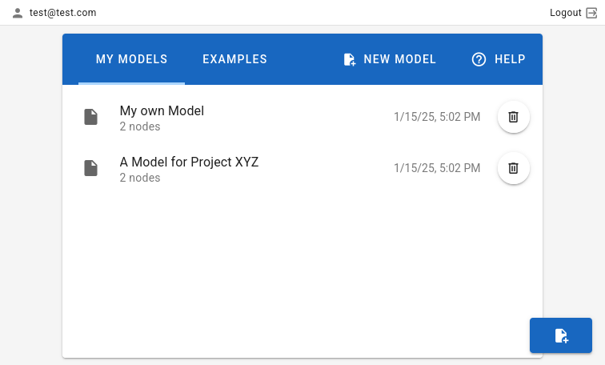

# Model List

The model list consists of two parts:

- your own saved models
- example models

You can only access your own saved models, if you are logged in with the same account and have previously saved a model.
Otherwise, the list will be empty.

Clicking on the model entry will load the model in the model editor. You can update a model by saving it again with the
same name. You can delete a model by clicking the trash button for the corresponding model in the list.

To create a new empty model, click on the "new model" button or on the blue button in the bottom-right corner.

Currently, only the following information is saved:

- all nodes of the model editor, including node parameters and connections between nodes
- estimate parameters and comments as shown in the estimate table

Currently, the following information is not saved:

- the result diagram
- the EVPI diagram
- the R-code
- settings
