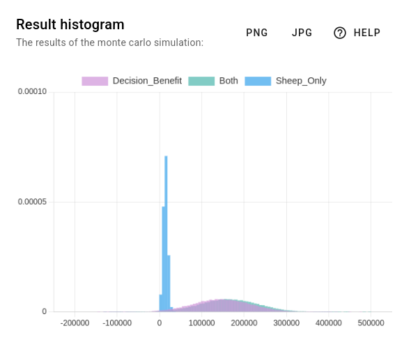

# Results Dashboard

The results dashboard shows the results of the Monte Carlo simulation. To generate the results, you need to evaluate
your model by clicking on the rocket button in the bottom-right corner.

There are two diagrams: the result diagram, and the Expected Value Of Perfect Information (EVPI) diagram.

## Result Diagram

The result diagram shows the output distribution of all result nodes. For each result node, one histogram is added to
the result diagram. By comparing two or more histograms with each other, you can draw conclusions about the decision
benefit.

You can influence how the result diagram is generated from the settings page. You can choose the number of histogram bins and the number of Monte Carlo runs.

A low number of bins will lead to coarse histograms. A large number of bins will lead to detailed histograms.

Depending on the number of histogram bins, you need to choose an appropriate number of Monte Carlo runs.
A low number of Monte Carlo runs might not be sufficient to accurately reflect the output distribution.
If you observe strong variations in the result diagram when re-evaluating the model (with the rocket button), you
should use more Monte Carlo runs.
If the histograms appear to be the same when lowering the number of Monte Carlo runs, you can safely reduce it.

Once you are happy with the result diagram, you can download it as a PNG or JPEG image file by clicking on the
respective download buttons.

## Expected Value Of Perfect Information Diagram

The EVPI diagram is explained in more detail in section "Advanced Features".
